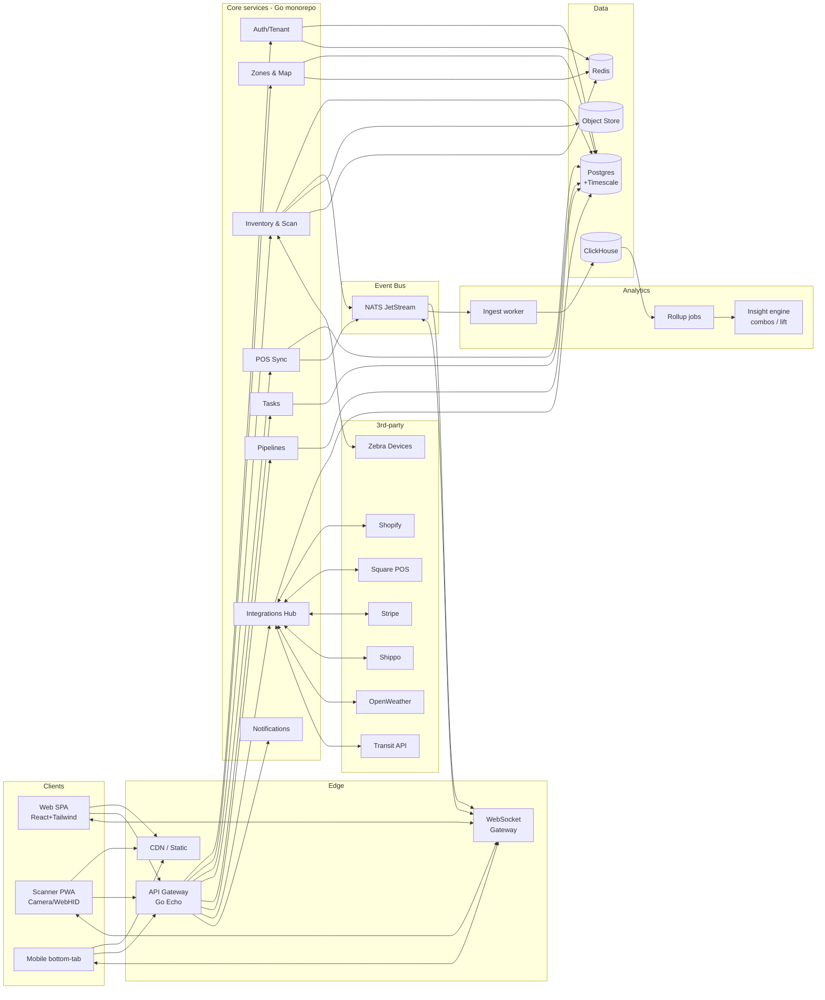

# live-rack — SaaS Warehouse Zoning, Real-Time Tracking & Analytics Platform

## Context

Greenfield SaaS targeting retail/warehouse operators. Connects physical store layout, item movement, POS sales, and external signals into one operational console. Differentiator: cross-signal intelligence (zone × demographics × weather × transit) plus scanner-based mis-scan prevention.

---

## Tech Stack

| Layer | Pick | Why |
|---|---|---|
| Frontend web | React 18 + Vite + TypeScript + Tailwind + shadcn/ui + Zustand + TanStack Query | Matches design bundle; fast DX; component primitives |
| Map canvas | Konva.js (react-konva) | Drag/resize zones, heatmap overlays, item pins; better than raw SVG for 100+ shapes |
| Charts | Recharts + visx (heatmap) | Sparklines, bars, 7×24 heatmap |
| Mobile scanner | PWA (web first) → React Native later | Camera barcode via `@zxing/browser`; WebHID for Zebra USB; offline queue via IndexedDB |
| Backend API | **Go 1.22 + Echo + sqlc + goose** _(locked)_ | Fits real-time/event-driven; one binary deploy; strong concurrency; team can hire |
| Realtime | NATS JetStream + WebSocket gateway (Go) | Durable streams, fan-out to clients, replay; replaces ad-hoc Redis Pub/Sub |
| Primary DB | PostgreSQL 16 + TimescaleDB ext | OLTP + time-series (sales, scans, sensor) in one engine |
| Analytics warehouse | ClickHouse | Heatmaps, co-purchase lift, demographic rollups; cheap columnar scans |
| Cache / queue | Redis 7 | Session, rate-limit, short-lived locks |
| Object storage | S3-compatible (R2/MinIO) | Scanner photos, returns evidence, exports |
| Auth | Clerk or WorkOS (SSO/SAML) | Faster than home-rolled; multi-tenant orgs out of the box |
| Search | Postgres trigram → Meilisearch later | ⌘K SKU/zone/task search |
| Observability | Grafana + Loki (logs) + Tempo (traces) + Prometheus | Single pane; OpenTelemetry SDKs in Go and React |
| CI/CD | GitHub Actions + Docker | Portable runtime artefacts |
| Hosting | _Deferred — choose at GA_ | Terraform abstracts Fly.io / AWS ECS / GCP Cloud Run; pick by cost + compliance posture closer to launch |
| IaC | Terraform | Stateful infra reproducible across hosting choices |

---

## High-Level Architecture



## Module Breakdown (Go monorepo)

```
live-rack/
├── apps/
│   ├── web/                React SPA
│   ├── scanner/            PWA (subset of web, install prompt)
│   └── docs/               Mintlify or Astro
├── services/
│   ├── api/                Echo HTTP+WS gateway, OpenAPI
│   ├── ingest/             NATS → ClickHouse worker
│   ├── rollup/             Cron-driven analytics jobs
│   ├── integrations/       Shopify/Square/Stripe/Shippo/Weather/Transit adapters
│   └── insight/            Co-purchase lift, time-to-sell, signal recommender
├── pkg/
│   ├── domain/             Pure entities (Zone, Item, Task, Pipeline, User, Org)
│   ├── store/              sqlc-generated Postgres + Timescale repos
│   ├── events/             NATS subject schemas, codecs
│   ├── auth/               Clerk/WorkOS adapter, RBAC + zone-scoped policy
│   └── observability/      OTel setup
├── deploy/
│   ├── terraform/
│   ├── docker/
│   └── grafana/            Dashboards as code
└── migrations/             goose SQL
```

---

## Data Model (core tables)

- `orgs`, `stores`, `users`, `roles`, `role_bindings`, `zone_scopes`
- `zones` (id, store_id, name, type, x, y, w, h, capacity, color, constraints jsonb)
- `items` (sku, org_id, name, category, price, attrs jsonb)
- `item_locations` (item_id, zone_id, qty, slot_addr, updated_at) — current state
- `scan_events` (Timescale hypertable: ts, scanner_id, sku, zone_id, action, valid, reason)
- `sales_events` (Timescale: ts, source, order_id, sku, qty, amount, channel)
- `tasks` (id, store_id, title, assignee, priority, due_at, status, zone_id)
- `pipelines`, `pipeline_stages`, `pipeline_cards`
- `integrations` (org_id, kind, status, config jsonb, secrets enc)
- `webhooks_inbound`, `webhooks_outbound` (idempotency keys)
- `audit_log` (immutable, partitioned by month)
- ClickHouse: `zone_perf_5m`, `heatmap_hourly`, `time_to_sell`, `combos_lift`

Multi-tenancy: `org_id` on every row + Postgres RLS policies; Clerk org → `org_id` mapping at gateway.

---

## Real-Time Flow

1. Scanner POSTs scan → `inventory` service validates against zone constraints + dwell rules.
2. Service writes to Postgres (`item_locations`) and emits `scan.recorded` to NATS.
3. WebSocket gateway subscribes per-org subject; pushes to connected clients.
4. `ingest` worker streams scan + sales events into ClickHouse for aggregation.
5. `insight` service publishes recommendations (e.g., weather-driven zone moves) onto `recommendation.created`; UI surfaces them on Analytics screen with Apply button.

POS integration: Square/Shopify webhooks land at gateway → `pos.sale` event → triggers task creation rules (low-stock restock, restoration pipeline intake).

---

## Integrations Strategy

| Vendor | Mode | Notes |
|---|---|---|
| Shopify | OAuth + webhooks | Inventory sync, order webhooks, location API for zone visibility |
| Square POS | OAuth + Catalog/Inventory webhooks | Real-time sales |
| Stripe | Connect + payment_intent webhooks | Refunds correlate to returns zone |
| Shippo | API polling | Outbound zone status |
| Zebra | WebHID (browser) + Bluetooth (mobile) | DataWedge profile shipped |
| OpenWeather | Cron pull (15m) | Per-store geo |
| Transit API | Cron pull (5m) | Per-store catchment |
| Klaviyo / NetSuite | Roadmap | Outbound events only initially |

All integrations live in `services/integrations` behind a uniform `Adapter` interface with retry/idempotency middleware.

---

## Security & RBAC

- Roles: Admin / Manager / Staff / Read-only / Service (matches design).
- Permission matrix stored as `role_permissions` (role × resource × action).
- Zone scoping enforced in repo layer (`WHERE zone_id = ANY(user.zone_scope)`).
- 2FA via Clerk (TOTP + WebAuthn).
- Audit log on every write; immutable, monthly partition.
- Secrets via AWS Secrets Manager / SOPS in dev.
- Service tokens are first-class users with API-only perms (Shopify integration as user).

---

## Git Strategy (per-phase branches, trunk-based)

**Model:** Trunk-based with short-lived feature branches per phase. `main` always deployable. Long-lived release tags `v0.x.y` per phase completion.

| Branch | Purpose | Lifecycle |
|---|---|---|
| `main` | Always green, deployable, protected | Permanent — squash-merge only, signed commits, required reviews |
| `phase/p{n}-{slug}` | Long-running phase integration branch | Cut from `main` at phase start, merged back at phase end |
| `feat/p{n}-{ticket}-{slug}` | Single ticket inside a phase | Branched from `phase/p{n}-*`, PR back into it |
| `fix/{ticket}-{slug}` | Hotfix off `main` | Cherry-picked back into active phase branch |
| `chore/`, `docs/`, `refactor/` | Non-feature work | Direct PR into `main` or active phase |

**Phase-to-branch map:**
```
phase/p0-foundations
phase/p1-zones-map
phase/p2-scanner
phase/p3-inventory
phase/p4-tasks
phase/p5-pipelines
phase/p6-pos-integrations
phase/p7-analytics
phase/p8-external-signals
phase/p9-rbac-audit
phase/p10-integrations-marketplace
phase/p11-hardening-launch
```

**Conventions:**
- **Conventional Commits** (`feat:`, `fix:`, `chore:`, `test:`, `docs:`, `refactor:`, `perf:`, `build:`, `ci:`).
- Commit body references ticket: `Refs LR-123`.
- **Semantic PR titles**, squash-merge to phase branch, merge-commit phase→main with `release:` prefix.
- **Branch protection on `main`**: required reviews (1+), required CI green, signed commits, linear history, no force-push.
- Tag releases `v0.{phase}.{patch}` — e.g. `v0.6.0` at end of P6.
- Pre-commit hooks: `gofmt`, `golangci-lint`, `eslint`, `prettier`, `gitleaks`.
- PR template enforces: linked Notion ticket, screenshots/recordings for UI changes, test evidence (coverage delta), deploy notes.
- Auto-rebase phase branch on `main` daily via GitHub Action; never merge `main` into phase branch.

---

## TDD Workflow (Red → Green → Refactor)

Every phase ticket follows TDD. CI rejects PRs whose new code lacks corresponding tests (enforced via coverage delta + diff-aware check).

**Layered testing pyramid:**

| Layer | Tool | Scope | Target coverage |
|---|---|---|---|
| Unit | Go `testing` + testify; Vitest | Pure functions, domain entities, reducers | ≥85% on `pkg/domain` |
| Repo / DB | `testcontainers-go` (real Postgres + Timescale) | sqlc queries, RLS policies, hypertable inserts | ≥80% on `pkg/store` |
| Service | Go service tests w/ NATS + Postgres in containers | Validation rules, event emission, idempotency | ≥75% per service |
| Contract | `oapi-codegen` + Pact | API + webhook payloads | 100% of public endpoints |
| Component (FE) | Vitest + Testing Library + MSW | React components, hooks, stores | ≥70% on `src/features` |
| E2E | Playwright | Cross-screen user journeys | Smoke per phase + regression bank |
| Load | k6 | Scan throughput, WS fan-out | p95 push <500ms @ 10k scans/min |
| Security | gosec, semgrep, trivy, OWASP ZAP baseline | Static + image + dynamic | Zero criticals |

**Per-ticket loop:**
1. **Red** — write failing test in the lowest meaningful layer (unit if possible, repo/contract if domain-level). Commit `test(p{n}): add failing test for X`.
2. **Green** — minimum code to pass. Commit `feat(p{n}): X (passes Y test)`.
3. **Refactor** — improve internals; tests still green. Commit `refactor(p{n}): clean up X`.
4. **Promote** — add E2E only when feature is user-facing.

**TDD-specific tooling decisions:**
- `gotestsum` for clean output and JUnit XML.
- `mockery` for interface mocks (auth, integrations).
- `wiremock` for outbound third-party HTTP (Shopify/Square sandboxes available too).
- `tilt` or `docker compose` for local stack — every dev gets identical Postgres+NATS+ClickHouse via `make dev`.
- VHS / Storybook for visual TDD on React components.
- Mutation testing on `pkg/domain` quarterly (`go-mutesting`) to validate test quality.

**CI gates per PR:**
- Lint (`golangci-lint`, `eslint`, `prettier --check`)
- Type check (`tsc --noEmit`)
- Unit + repo + service tests
- Contract tests (Pact verify against OpenAPI)
- Coverage diff (fail if drops > 0.5pp on touched files)
- E2E smoke (Playwright shard on phase branch nightly)
- Security: `gosec`, `trivy`, `gitleaks`, `semgrep`
- Bundle size budget (FE), binary size budget (Go)

---

## MISC

- **Local stack** — `docker compose up` brings Postgres+Timescale, NATS, ClickHouse, Redis, MinIO. `make seed` loads `data.jsx` fixtures.
- **TDD CI gate** — every PR rejected if coverage delta on touched files drops > 0.5pp or contract tests fail.
- **API contract tests** — OpenAPI spec checked into repo; `oapi-codegen` generates Go server + TS client; Pact verifies provider/consumer per merge.
- **E2E** — Playwright covers per phase: zone create → drag (P1), scan happy + mis-scan (P2), inventory realtime update (P3), task lifecycle (P4), pipeline card flow (P5), Shopify webhook → sale → task (P6), heatmap render (P7), weather signal → Apply (P8), RBAC/zone scope (P9).
- **Load** — k6 script in `tests/load/`: 10k scan events/min, 1k concurrent WS clients; p95 push latency target <500ms.
- **Observability** — Grafana dashboards as code under `deploy/grafana/`; SLO: API p95 <200ms, scan→UI push <1s, ingest lag <60s.
- **Security** — `gosec`, `trivy` images, `semgrep` SAST, `gitleaks` pre-commit, OWASP ZAP baseline in CI.
- **Phase exit criteria** — every phase ends with: all tickets `Done` in Notion, all tests green, phase E2E suite added to regression bank, demo recorded, release tag `v0.{phase}.0` pushed, `phase/p{n}-*` branch merged to `main` and deleted.
